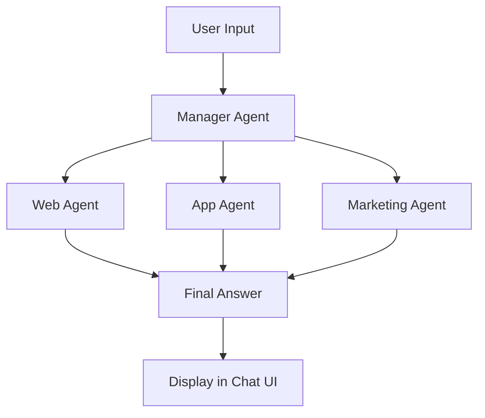

Here is a complete and ready-to-use `README.md` for your **Multi-Agent Chatbot** based on the latest code you've shared (using Chainlit + Gemini 2.0 Flash + Manager agent with handoffs):

---

````markdown
# 🤖 Multi-Agent Chatbot using Chainlit + Gemini API

This project is a smart **multi-agent chatbot** that automatically routes your question to the right expert agent using a **Manager Agent with handoffs**.

Built as part of the **Agentic AI - Quarter 4** course under the **Governor’s Initiative for AI & Web 3.0**.

---

## 🌟 Features

- 🔀 **Manager Agent** decides which expert (web, app, marketing) should handle your query
- 🧠 Powered by **Gemini 2.0 Flash** via OpenAI-compatible SDK
- ⚡ Interactive, real-time chat UI built with **Chainlit**
- 👤 Modular agent setup using the **Agents SDK**
- 🔐 API key stored securely using `.env` file

---

## 👥 Agents Setup

| Agent Name            | Role & Responsibility                                                                         |
|-----------------------|-----------------------------------------------------------------------------------------------|
| 🌐 Web Developer      | Answers HTML, CSS, JavaScript, React, Next.js, TailwindCSS, Bootstrap-related queries         |
| 📱 App Developer      | Handles mobile dev topics: Flutter, React Native, Android/iOS                                 |
| 📈 Marketing Agent    | Responds to SEO, Facebook/Google Ads, social media, and content marketing                     |
| 🧑‍💼 Manager Agent     | Routes user queries to the most relevant agent using `handoffs`                               |

---

## 🛠️ Tech Stack

| Tool / Library         | Purpose                                         |
|------------------------|-------------------------------------------------|
| 🐍 Python              | Core programming language                       |
| ⚡ Chainlit             | Frontend UI for real-time LLM chat              |
| 🧠 Gemini API (via SDK)| Google LLM backend used with OpenAI SDK         |
| 🔁 OpenAI Agents SDK   | Agent logic, handoffs, and async runner         |
| 🔐 python-dotenv       | Load and secure environment variables           |

---

## 🚀 How to Run the Project

### 1. Clone the Repository
```bash
git clone https://github.com/your-username/multi-agent-chatbot.git
cd multi-agent-chatbot
````

### 2. Create and Activate Virtual Environment

```bash
python -m venv .venv
.venv\Scripts\activate          # Windows
# or
source .venv/bin/activate      # macOS/Linux
```

### 3. Install Required Packages

```bash
pip install -r requirements.txt
```

### 4. Create a `.env` File

```env
GEMINI_API_KEY=your_gemini_api_key_here
```

🔑 Get your Gemini API key from: [https://makersuite.google.com/app/apikey](https://makersuite.google.com/app/apikey)

---

## 🧠 How It Works

1. User sends a message in the chat.
2. Manager Agent receives it and determines the most suitable expert agent.
3. The selected agent processes the input and generates a final response.
4. Chainlit updates the chat UI with the answer.



---

## 💬 Example Prompts

* "How do I make a responsive navbar in React?" → Web Agent
* "How can I integrate Firebase in Flutter?" → App Agent
* "Best tips for running Google Ads?" → Marketing Agent

---

## 🎯 Learning Outcomes

✅ Learned how to use **Agentic AI design** in real applications
✅ Built a **modular, multi-agent system** with `handoffs`
✅ Integrated **Gemini LLM** using OpenAI-compatible SDK
✅ Used **Chainlit** to create a smooth and fast UI
✅ Created a reusable and extendable agent system

---

## 🙌 Created For

**Agentic AI (Quarter 4)** – Governor's Initiative for AI & Web 3.0
👨‍🏫 Mentors: Sir Ameen Alam, Sir Hamzah Syed, Sir Bilal Khan, Sir Aneeq Khatri

---

## 👨‍💻 Author

**Muhammad Mubashir Saeedi**
🔗 [LinkedIn](https://www.linkedin.com/in/muhammad-mubashir-saeedi)
🐦 [X / Twitter](https://x.com/MubashirDev516)

---

## 📄 License

This project is created for educational and learning purposes under the GIAIC program.

---

#AgenticAI #Chainlit #Python #GeminiAPI #LLM #OpenAI #MultiAgent #GIAIC #Quarter4 #AIProjects
